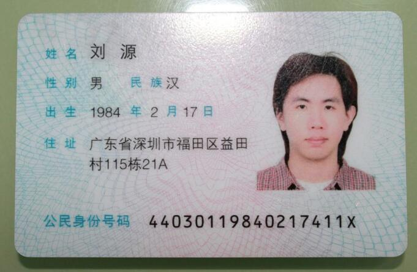
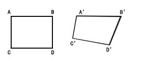
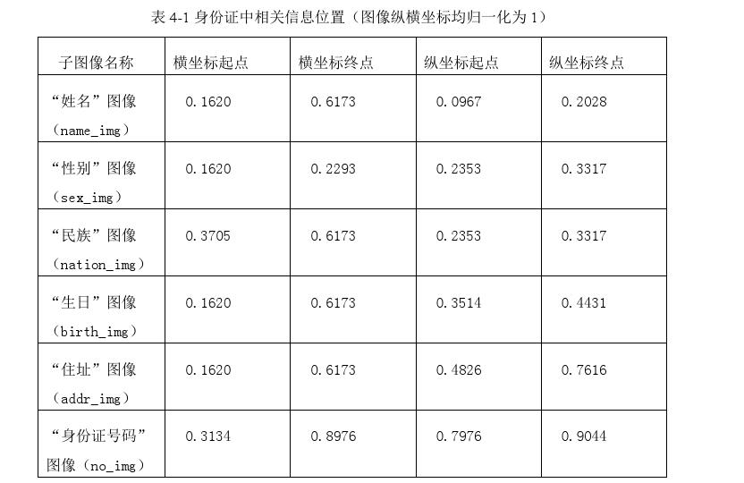

# idCardOcr
身份证识别  OCR, 本工具主要利用opencv对身份证图片进行预处理然后结合tesseract-ocr 进行识别，
经采样测试，识别达到90%以上，当然如果图片像素比较高、平整、且较小的倾斜度（此处非旋转度），识别率会更高。

建议使用场景：具有固定采样区域的项目

# 安装
环境要求：

python 2.7

依赖
* [tesseract-ocr](https://github.com/sam-ke/tesseract)。 必须安装中文字库（chi_sim.traineddata）

安装好依赖后，编辑文件，根据系统环境（Windows or Linux），修改tesseract可执行文件的全路径：include/functions.py，如下图所示


编译
* 以Linux为例,cd 到项目的根目录，执行如下shell

```shell
$ pyinstaller -F ocr.py
```

编译好的python可执行程序，编号的文件（ocr）存放在了  ./dist/目录中

使用

./dist/ocr -h


# 案例展示
#### 声明：以下图片均是通过搜索引擎获取，本人并不清楚该身份证的真实性，如确实存在此人，请您及时联系，
我会第一时间删除！

* 原图：



* 1. 二值化。

虽然二值化算法有很多种，但是并没有一种通用的二值化算法达到我们对身份证识别的要求，本案采用二值化算法池的思路，进行遍历试探，
这样能够有效增加识别的成功率。


* 2. 图形学处理：膨胀与模糊，主要起到降噪和轮廓增强


* 3. 获取身份证号码区域，计算其倾斜角度，如果角度大于10度，则进行透视变换进行校正，然后重复1、2操作



参考：https://blog.csdn.net/xieyan0811/article/details/71106539


  找到身份证号码所在的区域后，按照身份证文字排版结构比例进行估算，大致锁定目标区域的坐标，直接忽略其他区域，以防止无效区域对识别过程产生干扰




* 4. 处理结果


# 优化
当前该工具存在两个问题

* 执行速度
* 识别率

目前，即便是商用的身份证识别API服务，也不能做到100%的识别率，我们做的方向是，
人眼能够识别的，尽最大的努力改进算法能够机器识别。
有两个思路：针对速度，可以充分利用python的多线程，并行执行可以提高N倍的效率；
识别率的话，参考tesseract的文档对其字库进行专项训练也可以起到提高识别率的目的。

# 后记
该工具也是本着学习精神的一种技术探索，不足之处，欢迎大家批评指正！


