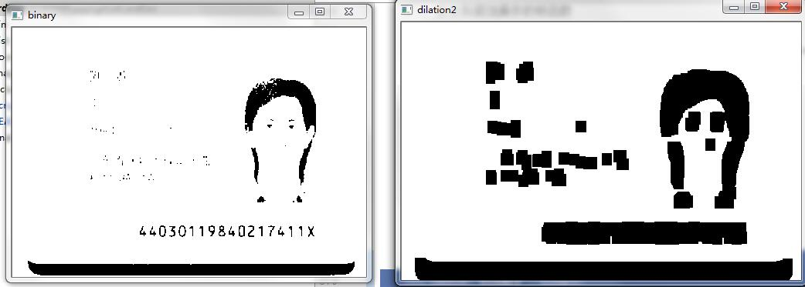
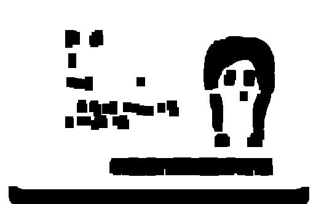
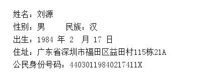

# idCardOcr
身份证识别  OCR, 本工具主要对身份证图片进行预处理然后结合tesseract-ocr 进行识别，
经采样测试，识别达到90%以上，当然如果图片像素比较高、平整、且较小的倾斜度（此处非旋转度），识别率会更高。

建议使用场景：具有固定采样区域的项目

# 安装
* 声明：以下图片均是通过搜索引擎获取，本人并不清楚该身份证的真实性，如确实存在此人，请您及时联系，
我会第一时间删除！

# 案例展示

* 原图：

* 二值化

* 图形学处理：膨胀与模糊，主要起到降噪和轮廓增强

* 处理结果

整理中，请等待。

